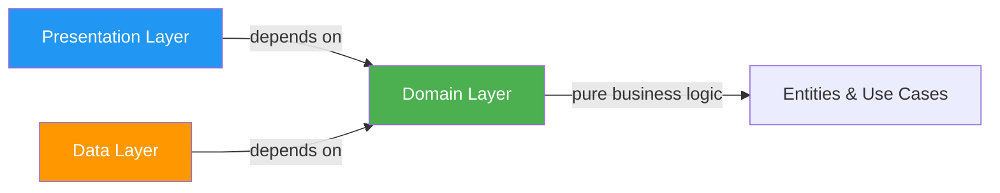

Clean Architecture organizes code into distinct layers, each with specific responsibilities and clear dependency rules. This architecture ensures that business logic remains independent of frameworks, databases, and UI.

## The Dependency Rule

<Warning>
The fundamental rule of Clean Architecture: **Source code dependencies must point only inward, toward higher-level policies.**

Outer layers can depend on inner layers, but inner layers must never depend on outer layers.
</Warning>



## Domain Layer

The **domain layer** is the heart of the application. It contains:
- Business entities and domain models
- Repository interfaces (contracts)
- Use cases that orchestrate business logic
- Domain-specific validation and rules

<Info>
The domain layer is completely framework-independent and implemented in pure Kotlin or Kotlin Multiplatform. It has no dependencies on Android or any external framework.
</Info>

### Domain Entities

Entities encapsulate business logic and validation:

```kotlin user-component/src/commonMain/kotlin/com/denisbrandi/androidrealca/user/domain/model/Email.kt
class Email(private val value: String) {
    fun isValid(): Boolean {
        return value.isNotBlank() && value.matches(Regex(EMAIL_ADDRESS_PATTERN))
    }

    private companion object {
        const val EMAIL_ADDRESS_PATTERN =
            "(?:[a-zA-Z0-9!#\$%&'*+/=?^_`{|}~-]+(?:\\.[a-zA-Z0-9!#\$%&'*+/=?^_`{|}~-]+)*|..."
    }
}
```

```kotlin product-component/src/commonMain/kotlin/com/denisbrandi/androidrealca/product/domain/model/Product.kt
data class Product(
    val id: String,
    val name: String,
    val money: Money,
    val imageUrl: String
)
```

```kotlin cart-component/src/commonMain/kotlin/com/denisbrandi/androidrealca/cart/domain/model/Cart.kt
data class Cart(val cartItems: List<CartItem>) {
    fun getSubtotal(): Money? {
        return if (cartItems.isNotEmpty()) {
            val currency = cartItems[0].money.currencySymbol
            var subtotal = 0.0
            cartItems.forEach {
                subtotal += it.money.amount * it.quantity
            }
            Money(subtotal, currency)
        } else {
            null
        }
    }

    fun getNumberOfItems(): Int {
        return cartItems.sumOf { it.quantity }
    }
}
```

<Tip>
Notice how the `Cart` entity contains business logic for calculating subtotals and counting items. This logic is independent of how the data is stored or displayed.
</Tip>

### Repository Interfaces

The domain layer defines repository contracts without implementation details:

```kotlin cart-component/src/commonMain/kotlin/com/denisbrandi/androidrealca/cart/domain/repository/CartRepository.kt
internal interface CartRepository {
    fun updateCartItem(userId: String, cartItem: CartItem)
    fun observeCart(userId: String): Flow<Cart>
    fun getCart(userId: String): Cart
}
```

```kotlin user-component/src/commonMain/kotlin/com/denisbrandi/androidrealca/user/domain/repository/UserRepository.kt
internal interface UserRepository {
    suspend fun login(loginRequest: LoginRequest): Answer<Unit, LoginError>
    fun getUser(): User
    fun isLoggedIn(): Boolean
}
```

```kotlin product-component/src/commonMain/kotlin/com/denisbrandi/androidrealca/product/domain/repository/ProductRepository.kt
internal interface ProductRepository {
    suspend fun getProducts(): Answer<List<Product>, Unit>
}
```

```kotlin wishlist-component/src/commonMain/kotlin/com/denisbrandi/androidrealca/wishlist/domain/repository/WishlistRepository.kt
internal interface WishlistRepository {
    fun addToWishlist(userId: String, wishlistItem: WishlistItem)
    fun removeFromWishlist(userId: String, wishlistItemId: String)
    fun observeWishlist(userId: String): Flow<List<WishlistItem>>
}
```

<Note>
Repositories return domain models (like `Cart`, `Product`, `User`), not DTOs or database entities. This keeps the domain layer pure.
</Note>

### Use Cases

Use cases orchestrate business logic by coordinating between entities and repositories:

```kotlin cart-component/src/commonMain/kotlin/com/denisbrandi/androidrealca/cart/domain/usecase/AddCartItemUseCase.kt
internal class AddCartItemUseCase(
    private val getUser: GetUser,
    private val cartRepository: CartRepository,
    private val updateCartItem: UpdateCartItem
) : AddCartItem {
    override fun invoke(cartItem: CartItem) {
        val cartItemInCart = cartRepository.getCart(getUser().id).cartItems.find {
            it.id == cartItem.id
        }
        if (cartItemInCart != null) {
            updateCartItem(cartItemInCart.copy(quantity = cartItemInCart.quantity + cartItem.quantity))
        } else {
            updateCartItem(cartItem)
        }
    }
}
```

```kotlin user-component/src/commonMain/kotlin/com/denisbrandi/androidrealca/user/domain/usecase/LoginUseCase.kt
internal class LoginUseCase(
    private val userRepository: UserRepository
) : Login {
    override suspend fun invoke(loginRequest: LoginRequest): Answer<Unit, LoginError> {
        return when {
            !Email(loginRequest.email).isValid() -> {
                Answer.Error(LoginError.InvalidEmail)
            }
            !Password(loginRequest.password).isValid() -> {
                Answer.Error(LoginError.InvalidPassword)
            }
            else -> {
                return userRepository.login(loginRequest)
            }
        }
    }
}
```

### Use Case Interfaces

Use cases are exposed through functional interfaces:

```kotlin cart-component/src/commonMain/kotlin/com/denisbrandi/androidrealca/cart/domain/usecase/CartUseCases.kt
fun interface UpdateCartItem {
    operator fun invoke(cartItem: CartItem)
}

fun interface ObserveUserCart {
    operator fun invoke(): Flow<Cart>
}

fun interface AddCartItem {
    operator fun invoke(cartItem: CartItem)
}
```

```kotlin product-component/src/commonMain/kotlin/com/denisbrandi/androidrealca/product/domain/usecase/GetProducts.kt
fun interface GetProducts {
    suspend operator fun invoke(): Answer<List<Product>, Unit>
}
```

<Info>
Using `fun interface` enables concise lambda implementations and makes dependency injection cleaner.
</Info>

## Data Layer

The **data layer** implements repository interfaces and handles:
- Data fetching from network or cache
- Data persistence
- Data transformation (DTO ↔ Domain Model)
- Error handling

### Repository Implementations

#### Cart Repository

```kotlin cart-component/src/commonMain/kotlin/com/denisbrandi/androidrealca/cart/data/repository/RealCartRepository.kt
internal class RealCartRepository(
    private val cacheProvider: CacheProvider
) : CartRepository {

    private val flowCachedObject: FlowCachedObject<JsonCartCacheDto> by lazy {
        cacheProvider.getFlowCachedObject(
            fileName = "cart-cache",
            serializer = JsonCartCacheDto.serializer(),
            defaultValue = JsonCartCacheDto(emptyMap())
        )
    }

    override fun updateCartItem(userId: String, cartItem: CartItem) {
        val updatedCache = getUpdatedCacheForUser(userId) { userCart ->
            val cartItemInCache = userCart.find { it.id == cartItem.id }
            val cartItemDto = mapToDto(cartItem)
            if (cartItemInCache != null) {
                if (cartItem.quantity == 0) {
                    userCart.remove(cartItemInCache)
                } else {
                    val index = userCart.indexOf(cartItemInCache)
                    userCart[index] = cartItemDto
                }
            } else {
                userCart.add(cartItemDto)
            }
        }
        flowCachedObject.put(updatedCache)
    }

    override fun observeCart(userId: String): Flow<Cart> {
        return flowCachedObject.observe().map { cachedDto ->
            mapToCart(userId, cachedDto)
        }
    }

    override fun getCart(userId: String): Cart {
        return mapToCart(userId, flowCachedObject.get())
    }

    private fun mapToCart(userId: String, cachedDto: JsonCartCacheDto): Cart {
        return Cart(
            mapToCartItems(cachedDto.usersCart[userId] ?: emptyList())
        )
    }

    private fun mapToCartItems(dtos: List<JsonCartItemCacheDto>): List<CartItem> {
        return dtos.map { dto ->
            CartItem(
                id = dto.id,
                name = dto.name,
                money = Money(dto.price, dto.currency),
                imageUrl = dto.imageUrl,
                quantity = dto.quantity
            )
        }
    }
}
```

#### Product Repository

```kotlin product-component/src/commonMain/kotlin/com/denisbrandi/androidrealca/product/data/repository/RealProductRepository.kt
internal class RealProductRepository(
    private val httpClient: HttpClient
) : ProductRepository {
    override suspend fun getProducts(): Answer<List<Product>, Unit> {
        return try {
            val response =
                httpClient.get("https://api.json-generator.com/templates/Vc6TVI8VwZNT/data") {
                    headers {
                        append(HttpHeaders.ContentType, ContentType.Application.Json.toString())
                        val accessTokenHeader = AccessTokenProvider.getAccessTokenHeader()
                        append(accessTokenHeader.first, accessTokenHeader.second)
                    }
                }
            if (response.status.isSuccess()) {
                handleSuccessfulProductsResponse(response)
            } else {
                Answer.Error(Unit)
            }
        } catch (t: Throwable) {
            Answer.Error(Unit)
        }
    }

    private suspend fun handleSuccessfulProductsResponse(httpResponse: HttpResponse): Answer<List<Product>, Unit> {
        val responseBody = httpResponse.body<List<JsonProductResponseDTO>>()
        return Answer.Success(mapProducts(responseBody))
    }

    private fun mapProducts(jsonProducts: List<JsonProductResponseDTO>): List<Product> {
        return jsonProducts.map { jsonProduct ->
            Product(
                jsonProduct.id.toString(),
                jsonProduct.name,
                Money(jsonProduct.price, jsonProduct.currency),
                jsonProduct.imageUrl
            )
        }
    }
}
```

#### User Repository

```kotlin user-component/src/commonMain/kotlin/com/denisbrandi/androidrealca/user/data/repository/RealUserRepository.kt
internal class RealUserRepository(
    private val client: HttpClient,
    cacheProvider: CacheProvider
) : UserRepository {

    private val cachedObject: CachedObject<JsonUserCacheDTO> by lazy {
        cacheProvider.getCachedObject(
            fileName = "user-cache",
            serializer = JsonUserCacheDTO.serializer(),
            defaultValue = DEFAULT_USER
        )
    }

    override suspend fun login(loginRequest: LoginRequest): Answer<Unit, LoginError> {
        return try {
            val response = client.post("https://api.json-generator.com/templates/Q7s_NUVpyBND/data") {
                headers {
                    append(HttpHeaders.ContentType, ContentType.Application.Json.toString())
                    val accessTokenHeader = AccessTokenProvider.getAccessTokenHeader()
                    append(accessTokenHeader.first, accessTokenHeader.second)
                }
                setBody(JsonLoginRequestDTO(loginRequest.email, loginRequest.password))
            }
            if (response.status.isSuccess()) {
                handleSuccessfulLoginResponse(response)
            } else {
                handleFailingLoginResponse(response)
            }
        } catch (t: Throwable) {
            Answer.Error(LoginError.GenericError)
        }
    }

    private suspend fun handleSuccessfulLoginResponse(httpResponse: HttpResponse): Answer<Unit, LoginError> {
        val responseBody = httpResponse.body<JsonLoginResponseDTO>()
        cachedObject.put(JsonUserCacheDTO(responseBody.id, responseBody.fullName))
        return Answer.Success(Unit)
    }

    override fun getUser(): User {
        val cachedUser = cachedObject.get()
        return User(cachedUser.id, cachedUser.fullName)
    }

    override fun isLoggedIn(): Boolean {
        return cachedObject.get() != DEFAULT_USER
    }

    companion object {
        val DEFAULT_USER = JsonUserCacheDTO("", "")
    }
}
```

<Tip>
Notice how repositories handle:
- Abstracted storage via `CacheProvider`
- Network requests via `HttpClient`
- DTO to domain model mapping
- Error handling with type-safe `Answer<T, E>`
</Tip>

## Presentation Layer

The **presentation layer** handles UI and user interactions using:
- ViewModels to manage UI state
- Composable functions for rendering
- State flow for reactive updates

### ViewModels

```kotlin cart-ui/src/main/java/com/denisbrandi/androidrealca/cart/presentation/viewmodel/RealCartViewModel.kt
internal class RealCartViewModel(
    observeUserCart: ObserveUserCart,
    private val updateCartItem: UpdateCartItem,
    private val stateDelegate: StateDelegate<CartScreenState>
) : CartViewModel, StateViewModel<CartScreenState> by stateDelegate, ViewModel() {

    init {
        stateDelegate.setDefaultState(CartScreenState(Cart(emptyList())))
        observeUserCart().onEach { cart ->
            stateDelegate.updateState { CartScreenState(cart) }
        }.launchIn(viewModelScope)
    }

    override fun updateCartItemQuantity(cartItem: CartItem) {
        updateCartItem(cartItem)
    }
}
```

<Note>
The ViewModel depends on use case interfaces (`ObserveUserCart`, `UpdateCartItem`), not on repository implementations. This maintains the dependency inversion principle.
</Note>

## Dependency Assembly

The app module orchestrates dependency injection by connecting all layers:

```kotlin app/src/main/java/com/denisbrandi/androidrealca/di/CompositionRoot.kt
class CompositionRoot private constructor(
    applicationContext: Context
) {
    private val httpClient by lazy {
        RealHttpClientProvider.getClient()
    }
    private val cacheProvider by lazy {
        AndroidCacheProvider(applicationContext)
    }
    private val userComponentAssembler by lazy {
        UserComponentAssembler(httpClient, cacheProvider)
    }
    private val productComponentAssembler by lazy {
        ProductComponentAssembler(httpClient)
    }
    private val wishlistComponentAssembler by lazy {
        WishlistComponentAssembler(cacheProvider, userComponentAssembler.getUser)
    }
    private val cartComponentAssembler by lazy {
        CartComponentAssembler(cacheProvider, userComponentAssembler.getUser)
    }
    
    val plpUIAssembler by lazy {
        PLPUIAssembler(
            userComponentAssembler.getUser,
            productComponentAssembler.getProducts,
            wishlistComponentAssembler,
            cartComponentAssembler.addCartItem
        )
    }
    // ...
}
```

### Component Assembler

```kotlin cart-component/src/commonMain/kotlin/com/denisbrandi/androidrealca/cart/di/CartComponentAssembler.kt
class CartComponentAssembler(
    private val cacheProvider: CacheProvider,
    private val getUser: GetUser
) {
    private val cartRepository by lazy {
        RealCartRepository(cacheProvider)
    }

    val updateCartItem: UpdateCartItem by lazy {
        UpdateCartItemUseCase(getUser, cartRepository)
    }

    val observeUserCart: ObserveUserCart by lazy {
        ObserveUserCartUseCase(getUser, cartRepository)
    }
    
    val addCartItem: AddCartItem by lazy {
        AddCartItemUseCase(getUser, cartRepository, updateCartItem)
    }
}
```

## Benefits of Layer Separation

<CardGroup cols={2}>
  <Card title="Independent Testing" icon="flask">
    Each layer can be tested in isolation with appropriate test doubles
  </Card>
  <Card title="Framework Independence" icon="shield">
    Business logic is decoupled from Android and can run on any platform
  </Card>
  <Card title="Flexible Implementation" icon="arrows-rotate">
    Data sources and UI frameworks can be swapped without affecting business logic
  </Card>
  <Card title="Clear Contracts" icon="file-contract">
    Interfaces define clear boundaries and contracts between layers
  </Card>
</CardGroup>

## Next Steps

<CardGroup cols={2}>
  <Card title="SOLID Principles" icon="star" href="/architecture/solid-principles">
    See how SOLID principles are applied in each layer
  </Card>
  <Card title="Modularization" icon="puzzle-piece" href="/architecture/modularization">
    Learn about the module structure and dependencies
  </Card>
</CardGroup>