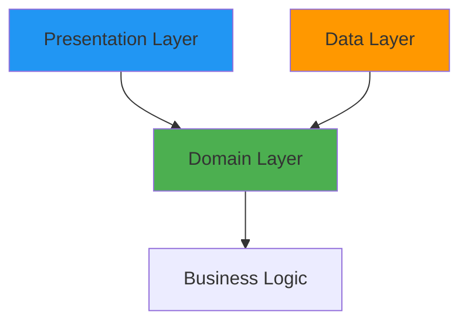

The Real Clean Architecture in Android demonstrates a pragmatic approach to building maintainable, testable, and scalable Android applications while strictly adhering to Clean Architecture principles and SOLID design patterns.

## Core Principles

This architecture is built on three fundamental pillars:

<CardGroup cols={3}>
  <Card title="Separation of Concerns" icon="layer-group">
    Clear boundaries between domain, data, and presentation layers
  </Card>
  <Card title="Dependency Rule" icon="arrow-right">
    Dependencies point inward toward the domain layer
  </Card>
  <Card title="Framework Independence" icon="cube">
    Domain logic is free from Android framework dependencies
  </Card>
</CardGroup>

## Architecture Layers

The application is organized into three distinct layers, each with specific responsibilities:

<Steps>
  <Step title="Domain Layer">
    Contains business logic, entities, and use cases. This layer is completely framework-independent and written in pure Kotlin/Kotlin Multiplatform.
    
    **Key Components:**
    - Business entities (e.g., `Cart`, `Product`, `User`)
    - Repository interfaces
    - Use cases that orchestrate business logic
    - Domain-specific types and validation
  </Step>
  
  <Step title="Data Layer">
    Implements repository interfaces and handles data operations. Manages caching, network calls, and data transformation.
    
    **Key Components:**
    - Repository implementations
    - Data transfer objects (DTOs)
    - Data source abstractions
    - Data mapping logic
  </Step>
  
  <Step title="Presentation Layer">
    Handles UI rendering and user interactions. Built with Jetpack Compose and Android-specific frameworks.
    
    **Key Components:**
    - ViewModels
    - Composable screens
    - UI state models
    - Presentation logic
  </Step>
</Steps>

## Dependency Flow

The architecture follows the **Dependency Inversion Principle**, ensuring that dependencies flow from outer layers toward the domain core:



<Info>
The domain layer defines interfaces (contracts), while outer layers provide implementations. This allows the core business logic to remain independent of implementation details.
</Info>

## Real-World Example: Cart Feature

Let's see how the layers work together in the cart feature:

### Domain Layer

Defines the business entity and repository contract:

```kotlin cart-component/src/commonMain/kotlin/com/denisbrandi/androidrealca/cart/domain/model/Cart.kt
data class Cart(val cartItems: List<CartItem>) {
    fun getSubtotal(): Money? {
        return if (cartItems.isNotEmpty()) {
            val currency = cartItems[0].money.currencySymbol
            var subtotal = 0.0
            cartItems.forEach {
                subtotal += it.money.amount * it.quantity
            }
            Money(subtotal, currency)
        } else {
            null
        }
    }

    fun getNumberOfItems(): Int {
        return cartItems.sumOf { it.quantity }
    }
}
```

```kotlin cart-component/src/commonMain/kotlin/com/denisbrandi/androidrealca/cart/domain/repository/CartRepository.kt
internal interface CartRepository {
    fun updateCartItem(userId: String, cartItem: CartItem)
    fun observeCart(userId: String): Flow<Cart>
    fun getCart(userId: String): Cart
}
```

### Data Layer

Implements the repository interface:

```kotlin cart-component/src/commonMain/kotlin/com/denisbrandi/androidrealca/cart/data/repository/RealCartRepository.kt
internal class RealCartRepository(
    private val cacheProvider: CacheProvider
) : CartRepository {

    private val flowCachedObject: FlowCachedObject<JsonCartCacheDto> by lazy {
        cacheProvider.getFlowCachedObject(
            fileName = "cart-cache",
            serializer = JsonCartCacheDto.serializer(),
            defaultValue = JsonCartCacheDto(emptyMap())
        )
    }

    override fun observeCart(userId: String): Flow<Cart> {
        return flowCachedObject.observe().map { cachedDto ->
            mapToCart(userId, cachedDto)
        }
    }

    override fun getCart(userId: String): Cart {
        return mapToCart(userId, flowCachedObject.get())
    }
    
    // ... mapping logic
}
```

### Presentation Layer

Consumes use cases to display data:

```kotlin cart-ui/src/main/java/com/denisbrandi/androidrealca/cart/presentation/viewmodel/RealCartViewModel.kt
internal class RealCartViewModel(
    observeUserCart: ObserveUserCart,
    private val updateCartItem: UpdateCartItem,
    private val stateDelegate: StateDelegate<CartScreenState>
) : CartViewModel, StateViewModel<CartScreenState> by stateDelegate, ViewModel() {

    init {
        stateDelegate.setDefaultState(CartScreenState(Cart(emptyList())))
        observeUserCart().onEach { cart ->
            stateDelegate.updateState { CartScreenState(cart) }
        }.launchIn(viewModelScope)
    }

    override fun updateCartItemQuantity(cartItem: CartItem) {
        updateCartItem(cartItem)
    }
}
```

## Module Dependency Graph

The project uses a modular architecture with clear dependency boundaries:


<Note>
Library modules (cache, httpclient, etc.) are omitted from the diagram for clarity. Component modules contain domain and data layers, while UI modules handle presentation.
</Note>

## Key Benefits

<AccordionGroup>
  <Accordion title="Testability">
    Each layer can be tested independently. Domain logic is tested with pure unit tests, while data and presentation layers use test doubles and mocks.
    
    Example test repository:
    ```kotlin
    class TestCartRepository : CartRepository {
        val updateCartItemInvocations: MutableList<Pair<String, CartItem>> = mutableListOf()
        val cartUpdates = mutableMapOf<String, Flow<Cart>>()
        
        override fun updateCartItem(userId: String, cartItem: CartItem) {
            updateCartItemInvocations.add(userId to cartItem)
        }
        // ...
    }
    ```
  </Accordion>
  
  <Accordion title="Maintainability">
    Clear separation of concerns makes it easy to locate and modify code. Each module has a single, well-defined responsibility.
  </Accordion>
  
  <Accordion title="Scalability">
    New features can be added as independent modules without affecting existing code. The modular structure supports parallel development.
  </Accordion>
  
  <Accordion title="Platform Independence">
    Component modules use Kotlin Multiplatform, enabling code sharing across platforms. They compile faster since they don't depend on the Android framework.
  </Accordion>
</AccordionGroup>

## Next Steps

<CardGroup cols={2}>
  <Card title="Clean Architecture Deep Dive" icon="layer-group" href="/architecture/clean-architecture">
    Explore the three layers in detail with real code examples
  </Card>
  <Card title="SOLID Principles" icon="star" href="/architecture/solid-principles">
    Learn how SOLID principles are applied throughout the codebase
  </Card>
  <Card title="Modularization Strategy" icon="puzzle-piece" href="/architecture/modularization">
    Understand the Package by Component approach and module types
  </Card>
  <Card title="Component Examples" icon="code" href="/components/cart-component">
    See complete component implementations
  </Card>
</CardGroup>