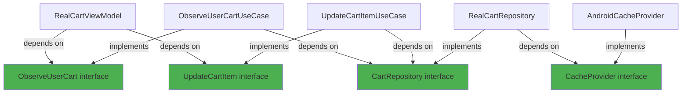

SOLID principles guide the design of the Real Clean Architecture, ensuring code is maintainable, extensible, and testable. Let's explore how each principle is applied with real examples from the codebase.

## Single Responsibility Principle (SRP)

<Info>
**Definition:** A class should have only one reason to change.

Each class should focus on a single, well-defined responsibility.
</Info>

### Use Case: Single Responsibility

Each use case has exactly one responsibility:

```kotlin cart-component/src/commonMain/kotlin/com/denisbrandi/androidrealca/cart/domain/usecase/AddCartItemUseCase.kt
internal class AddCartItemUseCase(
    private val getUser: GetUser,
    private val cartRepository: CartRepository,
    private val updateCartItem: UpdateCartItem
) : AddCartItem {
    override fun invoke(cartItem: CartItem) {
        val cartItemInCart = cartRepository.getCart(getUser().id).cartItems.find {
            it.id == cartItem.id
        }
        if (cartItemInCart != null) {
            updateCartItem(cartItemInCart.copy(quantity = cartItemInCart.quantity + cartItem.quantity))
        } else {
            updateCartItem(cartItem)
        }
    }
}
```

**Responsibility:** Add an item to the cart, handling the case where the item already exists.

```kotlin user-component/src/commonMain/kotlin/com/denisbrandi/androidrealca/user/domain/usecase/LoginUseCase.kt
internal class LoginUseCase(
    private val userRepository: UserRepository
) : Login {
    override suspend fun invoke(loginRequest: LoginRequest): Answer<Unit, LoginError> {
        return when {
            !Email(loginRequest.email).isValid() -> {
                Answer.Error(LoginError.InvalidEmail)
            }
            !Password(loginRequest.password).isValid() -> {
                Answer.Error(LoginError.InvalidPassword)
            }
            else -> {
                return userRepository.login(loginRequest)
            }
        }
    }
}
```

**Responsibility:** Validate login credentials and delegate authentication to the repository.

### Repository: Data Access Only

Repositories focus solely on data access and persistence:

```kotlin product-component/src/commonMain/kotlin/com/denisbrandi/androidrealca/product/data/repository/RealProductRepository.kt
internal class RealProductRepository(
    private val httpClient: HttpClient
) : ProductRepository {
    override suspend fun getProducts(): Answer<List<Product>, Unit> {
        return try {
            val response = httpClient.get("https://api.json-generator.com/templates/Vc6TVI8VwZNT/data") {
                headers {
                    append(HttpHeaders.ContentType, ContentType.Application.Json.toString())
                    val accessTokenHeader = AccessTokenProvider.getAccessTokenHeader()
                    append(accessTokenHeader.first, accessTokenHeader.second)
                }
            }
            if (response.status.isSuccess()) {
                handleSuccessfulProductsResponse(response)
            } else {
                Answer.Error(Unit)
            }
        } catch (t: Throwable) {
            Answer.Error(Unit)
        }
    }

    private fun mapProducts(jsonProducts: List<JsonProductResponseDTO>): List<Product> {
        return jsonProducts.map { jsonProduct ->
            Product(
                jsonProduct.id.toString(),
                jsonProduct.name,
                Money(jsonProduct.price, jsonProduct.currency),
                jsonProduct.imageUrl
            )
        }
    }
}
```

**Responsibility:** Fetch products from the network and map them to domain models.

### Domain Entity: Business Logic Only

```kotlin user-component/src/commonMain/kotlin/com/denisbrandi/androidrealca/user/domain/model/Email.kt
class Email(private val value: String) {
    fun isValid(): Boolean {
        return value.isNotBlank() && value.matches(Regex(EMAIL_ADDRESS_PATTERN))
    }

    private companion object {
        const val EMAIL_ADDRESS_PATTERN = "(?:[a-zA-Z0-9!#\$%&'*+/=?^_`{|}~-]+..."
    }
}
```

**Responsibility:** Validate email format according to business rules.

<Tip>
By keeping responsibilities focused, each class is easier to understand, test, and maintain. Changes to one responsibility don't ripple through the codebase.
</Tip>

## Open/Closed Principle (OCP)

<Info>
**Definition:** Software entities should be open for extension but closed for modification.

You should be able to add new functionality without changing existing code.
</Info>

### Repository Abstraction

New repository implementations can be added without modifying existing code:

```kotlin cart-component/src/commonMain/kotlin/com/denisbrandi/androidrealca/cart/domain/repository/CartRepository.kt
internal interface CartRepository {
    fun updateCartItem(userId: String, cartItem: CartItem)
    fun observeCart(userId: String): Flow<Cart>
    fun getCart(userId: String): Cart
}
```

**Production Implementation:**
```kotlin
internal class RealCartRepository(
    private val cacheProvider: CacheProvider
) : CartRepository {
    // Implementation using cache
}
```

**Test Implementation:**
```kotlin cart-component/src/commonTest/kotlin/com/denisbrandi/androidrealca/cart/domain/repository/TestCartRepository.kt
class TestCartRepository : CartRepository {
    val updateCartItemInvocations: MutableList<Pair<String, CartItem>> = mutableListOf()
    val cartUpdates = mutableMapOf<String, Flow<Cart>>()
    val carts = mutableMapOf<String, Cart>()

    override fun updateCartItem(userId: String, cartItem: CartItem) {
        updateCartItemInvocations.add(userId to cartItem)
    }

    override fun observeCart(userId: String): Flow<Cart> {
        return cartUpdates[userId] ?: throw IllegalStateException("no stubbing for userId")
    }

    override fun getCart(userId: String): Cart {
        return carts[userId] ?: throw IllegalStateException("no stubbing for userId")
    }
}
```

<Note>
New implementations (like a network-backed repository) can be added without modifying the interface or existing implementations.
</Note>

### Functional Use Case Interfaces

Functional interfaces allow multiple implementations:

```kotlin cart-component/src/commonMain/kotlin/com/denisbrandi/androidrealca/cart/domain/usecase/CartUseCases.kt
fun interface UpdateCartItem {
    operator fun invoke(cartItem: CartItem)
}

fun interface ObserveUserCart {
    operator fun invoke(): Flow<Cart>
}

fun interface AddCartItem {
    operator fun invoke(cartItem: CartItem)
}
```

These can be implemented with classes or lambdas, extended for different behaviors without modification.

### Cache Provider Abstraction

```kotlin cache/src/commonMain/kotlin/com/denisbrandi/androidrealca/cache/CacheProvider.kt
interface CacheProvider {
    fun <T : Any> getCachedObject(
        fileName: String,
        serializer: KSerializer<T>,
        defaultValue: T
    ): CachedObject<T>

    fun <T : Any> getFlowCachedObject(
        fileName: String,
        serializer: KSerializer<T>,
        defaultValue: T
    ): FlowCachedObject<T>
}
```

**Android Implementation:**
```kotlin
class AndroidCacheProvider(context: Context) : CacheProvider {
    // Uses SharedPreferences
}
```

**Test Implementation:**
```kotlin
class TestCacheProvider : CacheProvider {
    // Uses in-memory storage
}
```

## Liskov Substitution Principle (LSP)

<Info>
**Definition:** Objects of a superclass should be replaceable with objects of a subclass without breaking the application.

Subtypes must be substitutable for their base types.
</Info>

### Repository Substitution

All `CartRepository` implementations can be used interchangeably:

```kotlin
// In production
val repository: CartRepository = RealCartRepository(cacheProvider)

// In tests
val repository: CartRepository = TestCartRepository()

// Usage is identical
val cart = repository.getCart(userId)
repository.updateCartItem(userId, cartItem)
```

The use case doesn't need to know which implementation it's using:

```kotlin cart-component/src/commonMain/kotlin/com/denisbrandi/androidrealca/cart/domain/usecase/UpdateCartItemUseCase.kt
internal class UpdateCartItemUseCase(
    private val getUser: GetUser,
    private val cartRepository: CartRepository  // Any implementation works
) : UpdateCartItem {
    override fun invoke(cartItem: CartItem) {
        cartRepository.updateCartItem(getUser().id, cartItem)
    }
}
```

### Answer Type Substitution

The `Answer<T, E>` type is a sealed class with substitutable subtypes:

```kotlin foundations/src/commonMain/kotlin/com/denisbrandi/androidrealca/foundations/Answer.kt
sealed class Answer<out T, out E> {
    data class Success<out T>(
        val data: T,
    ) : Answer<T, Nothing>()

    data class Error<out E>(
        val reason: E,
    ) : Answer<Nothing, E>()

    fun <C> fold(
        success: (T) -> C,
        error: (E) -> C,
    ): C =
        when (this) {
            is Success -> success(data)
            is Error -> error(reason)
        }
}
```

Usage:
```kotlin
val result: Answer<List<Product>, Unit> = repository.getProducts()

// Both Success and Error can be used as Answer
val success: Answer<List<Product>, Unit> = Answer.Success(products)
val error: Answer<List<Product>, Unit> = Answer.Error(Unit)
```

## Interface Segregation Principle (ISP)

<Info>
**Definition:** Clients should not be forced to depend on interfaces they don't use.

Many specific interfaces are better than one general-purpose interface.
</Info>

### Focused Repository Interfaces

Each repository exposes only the methods needed for its domain:

```kotlin user-component/src/commonMain/kotlin/com/denisbrandi/androidrealca/user/domain/repository/UserRepository.kt
internal interface UserRepository {
    suspend fun login(loginRequest: LoginRequest): Answer<Unit, LoginError>
    fun getUser(): User
    fun isLoggedIn(): Boolean
}
```

```kotlin wishlist-component/src/commonMain/kotlin/com/denisbrandi/androidrealca/wishlist/domain/repository/WishlistRepository.kt
internal interface WishlistRepository {
    fun addToWishlist(userId: String, wishlistItem: WishlistItem)
    fun removeFromWishlist(userId: String, wishlistItemId: String)
    fun observeWishlist(userId: String): Flow<List<WishlistItem>>
}
```

<Tip>
Each interface is tailored to its specific use case. Users of `UserRepository` don't see wishlist methods, and vice versa.
</Tip>

### Segregated Use Case Interfaces

Instead of one large interface, use cases are split into focused functional interfaces:

```kotlin cart-component/src/commonMain/kotlin/com/denisbrandi/androidrealca/cart/domain/usecase/CartUseCases.kt
fun interface UpdateCartItem {
    operator fun invoke(cartItem: CartItem)
}

fun interface ObserveUserCart {
    operator fun invoke(): Flow<Cart>
}

fun interface AddCartItem {
    operator fun invoke(cartItem: CartItem)
}
```

Clients depend only on what they need:

```kotlin
// ViewModel only needs these two
class RealCartViewModel(
    observeUserCart: ObserveUserCart,
    private val updateCartItem: UpdateCartItem,
    // ...
)

// Composition root can inject just what's needed
PLPUIAssembler(
    userComponentAssembler.getUser,
    productComponentAssembler.getProducts,
    wishlistComponentAssembler,
    cartComponentAssembler.addCartItem  // Only needs addCartItem
)
```

### Cache Interface Segregation

```kotlin cache/src/commonMain/kotlin/com/denisbrandi/androidrealca/cache/CacheProvider.kt
interface CacheProvider {
    fun <T : Any> getCachedObject(
        fileName: String,
        serializer: KSerializer<T>,
        defaultValue: T
    ): CachedObject<T>

    fun <T : Any> getFlowCachedObject(
        fileName: String,
        serializer: KSerializer<T>,
        defaultValue: T
    ): FlowCachedObject<T>
}
```

Clients can request specific cache types without dealing with unrelated functionality.

## Dependency Inversion Principle (DIP)

<Info>
**Definition:** High-level modules should not depend on low-level modules. Both should depend on abstractions.

Abstractions should not depend on details. Details should depend on abstractions.
</Info>

### Use Cases Depend on Abstractions

Use cases depend on repository interfaces, not implementations:

```kotlin cart-component/src/commonMain/kotlin/com/denisbrandi/androidrealca/cart/domain/usecase/AddCartItemUseCase.kt
internal class AddCartItemUseCase(
    private val getUser: GetUser,                    // Abstraction (fun interface)
    private val cartRepository: CartRepository,      // Abstraction (interface)
    private val updateCartItem: UpdateCartItem       // Abstraction (fun interface)
) : AddCartItem {
    override fun invoke(cartItem: CartItem) {
        val cartItemInCart = cartRepository.getCart(getUser().id).cartItems.find {
            it.id == cartItem.id
        }
        if (cartItemInCart != null) {
            updateCartItem(cartItemInCart.copy(quantity = cartItemInCart.quantity + cartItem.quantity))
        } else {
            updateCartItem(cartItem)
        }
    }
}
```

<Note>
The use case has **no knowledge** of `RealCartRepository` or any concrete implementation. It depends only on the `CartRepository` interface.
</Note>

### Repository Depends on Abstractions

Repositories depend on abstract cache and HTTP client interfaces:

```kotlin user-component/src/commonMain/kotlin/com/denisbrandi/androidrealca/user/data/repository/RealUserRepository.kt
internal class RealUserRepository(
    private val client: HttpClient,           // Abstraction (Ktor interface)
    cacheProvider: CacheProvider              // Abstraction (interface)
) : UserRepository {
    
    private val cachedObject: CachedObject<JsonUserCacheDTO> by lazy {
        cacheProvider.getCachedObject(
            fileName = "user-cache",
            serializer = JsonUserCacheDTO.serializer(),
            defaultValue = DEFAULT_USER
        )
    }
    // ...
}
```

### Dependency Injection via Assemblers

The composition root wires up dependencies, maintaining the inversion:

```kotlin cart-component/src/commonMain/kotlin/com/denisbrandi/androidrealca/cart/di/CartComponentAssembler.kt
class CartComponentAssembler(
    private val cacheProvider: CacheProvider,  // Receives abstraction
    private val getUser: GetUser               // Receives abstraction
) {
    private val cartRepository by lazy {
        RealCartRepository(cacheProvider)      // Creates concrete implementation
    }

    val updateCartItem: UpdateCartItem by lazy {
        UpdateCartItemUseCase(getUser, cartRepository)  // Injects abstraction
    }

    val observeUserCart: ObserveUserCart by lazy {
        ObserveUserCartUseCase(getUser, cartRepository)
    }
    
    val addCartItem: AddCartItem by lazy {
        AddCartItemUseCase(getUser, cartRepository, updateCartItem)
    }
}
```

```kotlin app/src/main/java/com/denisbrandi/androidrealca/di/CompositionRoot.kt
class CompositionRoot private constructor(
    applicationContext: Context
) {
    private val httpClient by lazy {
        RealHttpClientProvider.getClient()     // Concrete implementation
    }
    
    private val cacheProvider by lazy {
        AndroidCacheProvider(applicationContext)  // Concrete implementation
    }
    
    private val userComponentAssembler by lazy {
        UserComponentAssembler(httpClient, cacheProvider)  // Pass abstractions
    }
    
    private val cartComponentAssembler by lazy {
        CartComponentAssembler(cacheProvider, userComponentAssembler.getUser)
    }
    
    val cartUIAssembler by lazy {
        CartUIAssembler(cartComponentAssembler)  // UI depends on component abstraction
    }
}
```

### Dependency Graph

The dependency flow always points toward abstractions:



<Warning>
Notice how the arrows point **toward** interfaces (green), never away from them. This is the essence of dependency inversion.
</Warning>

## SOLID Benefits in Practice

<CardGroup cols={2}>
  <Card title="Testability" icon="flask">
    Dependencies on abstractions make it easy to inject test doubles
    
    ```kotlin
    // Easy to test with TestCartRepository
    val useCase = AddCartItemUseCase(
        getUser = { testUser },
        cartRepository = TestCartRepository(),
        updateCartItem = mockUpdateCartItem
    )
    ```
  </Card>
  
  <Card title="Flexibility" icon="arrows-rotate">
    Implementations can be swapped without changing dependent code
    
    ```kotlin
    // Switch from cache to network
    val repository: CartRepository = 
        NetworkCartRepository(httpClient)
    // Use cases don't need to change
    ```
  </Card>
  
  <Card title="Maintainability" icon="wrench">
    Focused responsibilities make code easier to understand and modify
    
    ```kotlin
    // Each use case has one clear job
    class AddCartItemUseCase { /* ... */ }
    class UpdateCartItemUseCase { /* ... */ }
    class ObserveUserCartUseCase { /* ... */ }
    ```
  </Card>
  
  <Card title="Extensibility" icon="plus">
    New features can be added without modifying existing code
    
    ```kotlin
    // Add new repository implementation
    class RemoteCartRepository : CartRepository {
        // New implementation
    }
    // Existing code continues to work
    ```
  </Card>
</CardGroup>

## Summary

<AccordionGroup>
  <Accordion title="Single Responsibility Principle">
    Each class has one reason to change. Use cases, repositories, and entities each focus on a single concern.
  </Accordion>
  
  <Accordion title="Open/Closed Principle">
    Interfaces and abstractions allow new implementations without modifying existing code. Test and production implementations coexist.
  </Accordion>
  
  <Accordion title="Liskov Substitution Principle">
    All implementations of an interface are interchangeable. Code depends on contracts, not concrete types.
  </Accordion>
  
  <Accordion title="Interface Segregation Principle">
    Focused interfaces prevent clients from depending on unused methods. Functional interfaces provide maximum flexibility.
  </Accordion>
  
  <Accordion title="Dependency Inversion Principle">
    High-level policies (use cases) depend on abstractions, not implementations. The composition root wires up concrete dependencies.
  </Accordion>
</AccordionGroup>

## Next Steps

<CardGroup cols={2}>
  <Card title="Modularization" icon="puzzle-piece" href="/architecture/modularization">
    Learn how modules enforce architectural boundaries
  </Card>
  <Card title="Testing Strategy" icon="flask" href="/testing/overview">
    See how SOLID principles enable comprehensive testing
  </Card>
</CardGroup>