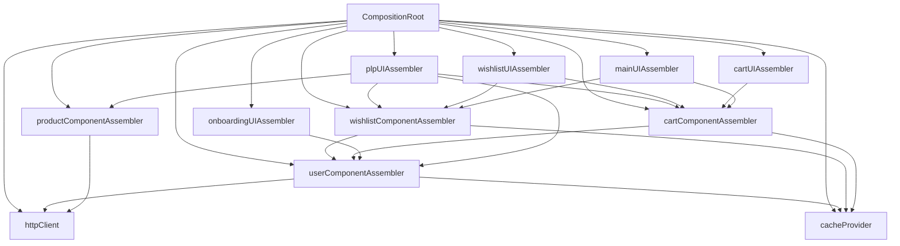
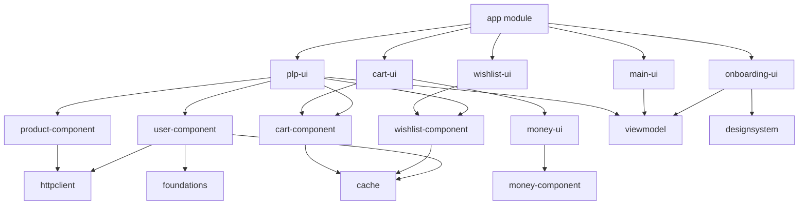

The `app` module is the Android application entry point that ties everything together. It contains the `CompositionRoot` for dependency injection, root navigation setup, platform-specific implementations, and the main activity.

## Module Overview

<CardGroup cols={2}>
  <Card title="CompositionRoot" icon="diagram-project" href="#compositionroot">
    Manual dependency injection container
  </Card>
  <Card title="Navigation" icon="route" href="#navigation">
    App-level navigation setup
  </Card>
  <Card title="Platform Implementations" icon="android" href="#platform-implementations">
    Android-specific implementations
  </Card>
  <Card title="Application Setup" icon="gear" href="#application-setup">
    App class and MainActivity
  </Card>
</CardGroup>

---

## Module Configuration

### build.gradle.kts

```kotlin
plugins {
    alias(libs.plugins.android.application)
    alias(libs.plugins.compose.compiler)
    alias(libs.plugins.kotlin.serialization)
}

android {
    namespace = "com.denisbrandi.androidrealca"
    compileSdk = 36

    defaultConfig {
        applicationId = "com.denisbrandi.androidrealca"
        minSdk = 24
        targetSdk = 36
        versionCode = 1
        versionName = "1.0"
    }
    // ...
}

dependencies {
    // Library modules
    implementation(project(":designsystem"))
    implementation(project(":cache"))
    implementation(project(":httpclient"))
    
    // Component modules
    implementation(project(":user-component"))
    implementation(project(":product-component"))
    implementation(project(":wishlist-component"))
    implementation(project(":cart-component"))
    
    // UI modules
    implementation(project(":onboarding-ui"))
    implementation(project(":plp-ui"))
    implementation(project(":wishlist-ui"))
    implementation(project(":cart-ui"))
    implementation(project(":main-ui"))
    
    // Android dependencies
    implementation(libs.androidx.core.ktx)
    implementation(libs.androidx.lifecycle.runtime.ktx)
    implementation(libs.androidx.activity.compose)
    implementation(platform(libs.androidx.compose.bom))
    implementation(libs.compose.navigation)
    // ...
}
```

<Info>
The app module depends on **all** other modules - it's the only module that brings everything together.
</Info>

---

## CompositionRoot

The `CompositionRoot` is a manual dependency injection container that constructs and wires all components in the application.

### File Structure

```
app/src/main/java/com/denisbrandi/androidrealca/di/
├── AndroidCacheProvider.kt
└── CompositionRoot.kt
```

### Full Implementation

From `app/src/main/java/com/denisbrandi/androidrealca/di/CompositionRoot.kt`:

```kotlin
class CompositionRoot private constructor(
    applicationContext: Context
) {
    private val httpClient by lazy {
        RealHttpClientProvider.getClient()
    }
    
    private val cacheProvider by lazy {
        AndroidCacheProvider(applicationContext)
    }
    
    private val userComponentAssembler by lazy {
        UserComponentAssembler(httpClient, cacheProvider)
    }
    
    private val productComponentAssembler by lazy {
        ProductComponentAssembler(httpClient)
    }
    
    private val wishlistComponentAssembler by lazy {
        WishlistComponentAssembler(cacheProvider, userComponentAssembler.getUser)
    }
    
    private val cartComponentAssembler by lazy {
        CartComponentAssembler(cacheProvider, userComponentAssembler.getUser)
    }
    
    val isUserLoggedIn by lazy {
        userComponentAssembler.isUserLoggedIn
    }
    
    val onboardingUIAssembler by lazy {
        OnboardingUIAssembler(userComponentAssembler.login)
    }
    
    val plpUIAssembler by lazy {
        PLPUIAssembler(
            userComponentAssembler.getUser,
            productComponentAssembler.getProducts,
            wishlistComponentAssembler,
            cartComponentAssembler.addCartItem
        )
    }
    
    val wishlistUIAssembler by lazy {
        WishlistUIAssembler(
            wishlistComponentAssembler, 
            cartComponentAssembler.addCartItem
        )
    }
    
    val cartUIAssembler by lazy {
        CartUIAssembler(cartComponentAssembler)
    }
    
    val mainUIAssembler by lazy {
        MainUIAssembler(
            wishlistComponentAssembler.observeUserWishlistIds, 
            cartComponentAssembler.observeUserCart
        )
    }

    companion object {
        lateinit var INSTANCE: CompositionRoot

        fun compose(applicationContext: Context) {
            INSTANCE = CompositionRoot(applicationContext)
        }
    }
}

val compositionRoot = CompositionRoot.INSTANCE
```

<Steps>
  <Step title="Singleton Instance">
    The `CompositionRoot` uses a singleton pattern initialized once in the `Application` class.
  </Step>

  <Step title="Lazy Initialization">
    All dependencies use `by lazy` to defer creation until first use, improving app startup time.
  </Step>

  <Step title="Dependency Graph Construction">
    The composition root builds the entire dependency graph:
    1. Creates platform implementations (`httpClient`, `cacheProvider`)
    2. Creates component assemblers with their dependencies
    3. Creates UI assemblers with required use cases
  </Step>

  <Step title="Public API">
    Only UI assemblers and essential use cases (like `isUserLoggedIn`) are exposed publicly.
  </Step>
</Steps>

### Dependency Flow



<Warning>
**No Dependency Injection Framework**

This architecture uses **manual dependency injection** instead of frameworks like Dagger or Hilt. This approach:
- Provides full control and transparency
- Reduces build time and complexity
- Makes the dependency graph explicit and debuggable
- Eliminates framework-specific annotations and generated code
</Warning>

---

## Navigation

The app module defines the root navigation graph that connects all screens.

### Navigation Setup

From `app/src/main/java/com/denisbrandi/androidrealca/navigation/RootNavigation.kt`:

```kotlin
@Serializable
object NavSplash

@Serializable
object NavLogin

@Serializable
object NavMain

@Composable
fun RootNavigation() {
    val navController = rememberNavController()
    NavHost(navController, startDestination = NavSplash) {
        composable<NavSplash> {
            val destination: Any = if (compositionRoot.isUserLoggedIn()) {
                NavMain
            } else {
                NavLogin
            }
            navController.navigate(route = destination)
        }
        composable<NavLogin> {
            compositionRoot.onboardingUIAssembler.LoginScreenDestination(
                onLoggedIn = { navController.navigate(route = NavMain) }
            )
        }
        composable<NavMain> {
            compositionRoot.mainUIAssembler.MainScreenDestination(
                RealBottomNavRouter
            )
        }
    }
}
```

<Steps>
  <Step title="Type-Safe Navigation">
    Uses Kotlin serialization for type-safe navigation with `@Serializable` route objects.
  </Step>

  <Step title="Splash Logic">
    The splash screen checks authentication state and navigates to either login or main screen.
  </Step>

  <Step title="Screen Composition">
    Screens are created via UI assemblers accessed through the `compositionRoot`.
  </Step>
</Steps>

### Bottom Navigation Router

```kotlin
private object RealBottomNavRouter : BottomNavRouter {
    @Composable
    override fun OpenPLPScreen() {
        compositionRoot.plpUIAssembler.PLPScreenDestination()
    }

    @Composable
    override fun OpenWishlistScreen() {
        compositionRoot.wishlistUIAssembler.WishlistScreenDestination()
    }

    @Composable
    override fun OpenCartScreen() {
        compositionRoot.cartUIAssembler.CartScreenDestination()
    }
}
```

<Tip>
The `BottomNavRouter` implementation is defined in the app module, allowing it to access all UI assemblers while keeping the `main-ui` module decoupled from other UI modules.
</Tip>

---

## Platform Implementations

The app module provides Android-specific implementations of cross-platform interfaces.

### AndroidCacheProvider

From `app/src/main/java/com/denisbrandi/androidrealca/di/AndroidCacheProvider.kt`:

```kotlin
class AndroidCacheProvider(
    private val applicationContext: Context
) : CacheProvider {

    private val settings by lazy {
        val sharedPrefs = PreferenceManager.getDefaultSharedPreferences(
            applicationContext
        )
        SharedPreferencesSettings(sharedPrefs)
    }

    override fun <T : Any> getCachedObject(
        fileName: String,
        serializer: KSerializer<T>,
        defaultValue: T
    ): CachedObject<T> {
        return RealCachedObject(fileName, settings, serializer, defaultValue)
    }

    override fun <T : Any> getFlowCachedObject(
        fileName: String,
        serializer: KSerializer<T>,
        defaultValue: T
    ): FlowCachedObject<T> {
        return RealFlowCachedObject(getCachedObject(fileName, serializer, defaultValue))
    }
}
```

<Info>
The `AndroidCacheProvider` adapts the multiplatform `cache` module to use Android's `SharedPreferences` via the Multiplatform Settings library.
</Info>

---

## Application Setup

### App Class

From `app/src/main/java/com/denisbrandi/androidrealca/App.kt`:

```kotlin
class App : Application() {
    override fun onCreate() {
        super.onCreate()
        CompositionRoot.compose(applicationContext)
    }
}
```

<Note>
The `App` class initializes the `CompositionRoot` during application startup, ensuring dependencies are ready before any activity launches.
</Note>

### MainActivity

From `app/src/main/java/com/denisbrandi/androidrealca/MainActivity.kt`:

```kotlin
class MainActivity : ComponentActivity() {
    override fun onCreate(savedInstanceState: Bundle?) {
        super.onCreate(savedInstanceState)
        enableEdgeToEdge()
        setContent {
            AppTheme {
                RootNavigation()
            }
        }
    }
}
```

<Steps>
  <Step title="Edge-to-Edge Display">
    Enables edge-to-edge display for modern Android UI.
  </Step>

  <Step title="Theme Application">
    Wraps the app in `AppTheme` from the `designsystem` module.
  </Step>

  <Step title="Navigation Setup">
    Launches the root navigation graph.
  </Step>
</Steps>

---

## Module Dependency Graph

The app module sits at the top of the dependency hierarchy:



---

## Testing the App Module

While the app module primarily contains wiring code, you can test:

<Accordion title="Integration Tests">
  Test that the composition root correctly wires dependencies:

  ```kotlin
  @Test
  fun `composition root provides all UI assemblers`() {
      val context = ApplicationProvider.getApplicationContext<Context>()
      CompositionRoot.compose(context)
      
      assertNotNull(compositionRoot.onboardingUIAssembler)
      assertNotNull(compositionRoot.plpUIAssembler)
      assertNotNull(compositionRoot.wishlistUIAssembler)
      assertNotNull(compositionRoot.cartUIAssembler)
      assertNotNull(compositionRoot.mainUIAssembler)
  }
  ```
</Accordion>

<Accordion title="Navigation Tests">
  Test navigation flows:

  ```kotlin
  @Test
  fun `splash navigates to login when not logged in`() {
      // Set up test composition root with stubbed isUserLoggedIn
      // Verify navigation to login screen
  }
  
  @Test
  fun `splash navigates to main when logged in`() {
      // Set up test composition root with logged-in user
      // Verify navigation to main screen
  }
  ```
</Accordion>

---

## Best Practices

<Warning>
**Single Composition Root**

Never create multiple composition roots or partial dependency graphs. All dependency construction happens in one place.
</Warning>

<Tip>
**Lazy Initialization**

Use `by lazy` for all dependencies to defer creation until needed. This improves app startup performance.
</Tip>

<Info>
**Private by Default**

Keep component assemblers and infrastructure private. Only expose UI assemblers and essential use cases.
</Info>

<Note>
**Application Context**

Always use `applicationContext` instead of activity context in the composition root to avoid memory leaks.
</Note>

### Composition Root Guidelines

<Steps>
  <Step title="Initialize in Application.onCreate()">
    Compose the dependency graph in `Application.onCreate()` before any activities start.
  </Step>

  <Step title="Use Constructor Injection">
    Pass dependencies through constructors at every level - never use service locator pattern.
  </Step>

  <Step title="Wire from Bottom Up">
    Create library modules first, then components, then UI assemblers.
  </Step>

  <Step title="Keep It Simple">
    Don't add abstractions or indirection. The composition root should be straightforward and explicit.
  </Step>
</Steps>

### Navigation Guidelines

<Steps>
  <Step title="Use Type-Safe Routes">
    Define route objects with `@Serializable` for compile-time safety.
  </Step>

  <Step title="Handle Back Stack Carefully">
    Clear the back stack when navigating between major flows (login → main).
  </Step>

  <Step title="Pass Callbacks, Not NavController">
    UI modules should receive navigation callbacks, not direct access to `NavController`.
  </Step>

  <Step title="Centralize Deep Linking">
    Handle all deep links in the root navigation graph for consistency.
  </Step>
</Steps>

---

## Comparison with DI Frameworks

Manual dependency injection vs. frameworks like Dagger/Hilt:

| Aspect | Manual DI | Dagger/Hilt |
|--------|-----------|-------------|
| **Setup Complexity** | Simple, explicit code | Requires annotations, modules |
| **Build Time** | Fast | Slower due to code generation |
| **Debuggability** | Easy - just follow the code | Harder - generated code |
| **Learning Curve** | Minimal | Steep |
| **Type Safety** | Full compile-time checking | Full compile-time checking |
| **Flexibility** | Complete control | Framework constraints |
| **Testing** | Easy - construct test graphs | Requires test modules |

<Tip>
For small to medium apps (< 50 screens), manual dependency injection provides the best developer experience. Only consider frameworks when the composition root becomes unmanageable.
</Tip>

---

## Summary

The app module is where Real Clean Architecture comes together:

✅ **Single entry point** for the entire application
✅ **Manual dependency injection** via `CompositionRoot`
✅ **Type-safe navigation** with Jetpack Compose Navigation
✅ **Platform-specific implementations** of cross-platform interfaces
✅ **Clear separation** between infrastructure (app) and features (UI modules)
✅ **Explicit dependency graph** that's easy to understand and debug

By keeping the app module focused on wiring and navigation, the architecture remains clean, testable, and maintainable.
