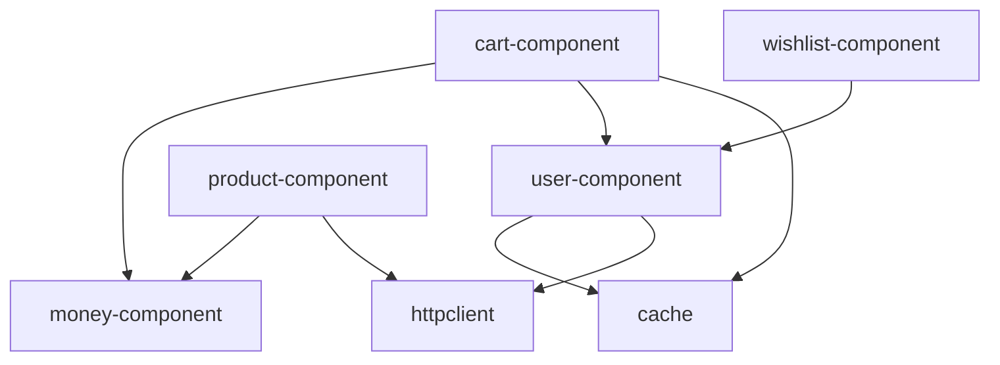

Component modules encapsulate business logic for specific features. Each component module contains both the **domain layer** (business rules, entities, use cases) and the **data layer** (repository implementations, DTOs, data sources).

## Module Overview

<CardGroup cols={2}>
  <Card title="cart-component" icon="shopping-cart" href="#cart-component">
    Shopping cart business logic
  </Card>
  <Card title="money-component" icon="dollar-sign" href="#money-component">
    Money and currency domain model
  </Card>
  <Card title="product-component" icon="box" href="#product-component">
    Product catalog management
  </Card>
  <Card title="user-component" icon="user" href="#user-component">
    User authentication and management
  </Card>
  <Card title="wishlist-component" icon="heart" href="#wishlist-component">
    Wishlist functionality
  </Card>
</CardGroup>

---

## Architecture Pattern

All component modules follow the same structure:

```
component-module/
├── domain/
│   ├── model/          # Domain entities
│   ├── repository/     # Repository interfaces
│   └── usecase/        # Business logic
├── data/
│   ├── model/          # DTOs for serialization
│   └── repository/     # Repository implementations
└── di/
    └── ComponentAssembler.kt  # Dependency injection
```

<Info>
The **domain layer** contains no framework dependencies and represents pure business logic. The **data layer** implements domain contracts using specific technologies (HTTP, cache, etc.).
</Info>

---

## cart-component

Manages shopping cart operations including adding items, updating quantities, and observing cart state.

### Module Dependencies

```kotlin
sourceSets {
    commonMain {
        dependencies {
            implementation(libs.coroutines.core)
            implementation(libs.kotlin.serialization)
            implementation(project(":cache"))
            implementation(project(":money-component"))
            implementation(project(":user-component"))
        }
    }
}
```

### Domain Layer

<Steps>
  <Step title="Domain Model">
    The `Cart` entity represents a user's shopping cart with business logic:

    ```kotlin
    data class Cart(val cartItems: List<CartItem>) {
        fun getSubtotal(): Money? {
            return if (cartItems.isNotEmpty()) {
                val currency = cartItems[0].money.currencySymbol
                var subtotal = 0.0
                cartItems.forEach {
                    subtotal += it.money.amount * it.quantity
                }
                Money(subtotal, currency)
            } else {
                null
            }
        }

        fun getNumberOfItems(): Int {
            return cartItems.sumOf { it.quantity }
        }
    }
    ```

    <Note>
    Notice how the `Cart` entity contains business logic for calculating subtotals and item counts - this keeps the presentation layer simple.
    </Note>
  </Step>

  <Step title="Repository Interface">
    Defines contracts for cart data operations:

    ```kotlin
    internal interface CartRepository {
        fun updateCartItem(userId: String, cartItem: CartItem)
        fun observeCart(userId: String): Flow<Cart>
        fun getCart(userId: String): Cart
    }
    ```
  </Step>

  <Step title="Use Cases">
    Functional interfaces representing business operations:

    ```kotlin
    fun interface UpdateCartItem {
        operator fun invoke(cartItem: CartItem)
    }

    fun interface ObserveUserCart {
        operator fun invoke(): Flow<Cart>
    }

    fun interface AddCartItem {
        operator fun invoke(cartItem: CartItem)
    }
    ```

    <Tip>
    Using `fun interface` enables SAM (Single Abstract Method) conversion, allowing lambdas to be used as implementations.
    </Tip>
  </Step>
</Steps>

### Data Layer

Implements cart persistence using the cache module:

```kotlin
class RealCartRepository(
    private val cacheProvider: CacheProvider
) : CartRepository {
    // Implementation uses FlowCachedObject for reactive cart updates
    // Serializes cart data as JsonCartCacheDto
}
```

### Dependency Injection

```kotlin
class CartComponentAssembler(
    private val cacheProvider: CacheProvider,
    private val getUser: GetUser
) {
    private val cartRepository by lazy {
        RealCartRepository(cacheProvider)
    }

    val updateCartItem: UpdateCartItem by lazy {
        UpdateCartItemUseCase(getUser, cartRepository)
    }

    val observeUserCart: ObserveUserCart by lazy {
        ObserveUserCartUseCase(getUser, cartRepository)
    }
    
    val addCartItem: AddCartItem by lazy {
        AddCartItemUseCase(getUser, cartRepository, updateCartItem)
    }
}
```

<Warning>
The `CartComponentAssembler` uses lazy initialization to avoid creating unnecessary instances. Dependencies are provided via constructor injection.
</Warning>

---

## money-component

Provides a domain model for representing monetary values with currency.

### Domain Model

```kotlin
data class Money(val amount: Double, val currencySymbol: String)
```

<Info>
This is a **pure domain module** with no data layer - it only contains the domain model used by other components like `cart-component` and `product-component`.
</Info>

### Usage Example

From `product-component`:

```kotlin
data class Product(
    val id: String,
    val name: String,
    val money: Money,
    val imageUrl: String
)
```

---

## product-component

Manages product catalog operations including fetching products from a remote API.

### Domain Layer

<Accordion title="Product Entity">
  ```kotlin
  data class Product(
      val id: String,
      val name: String,
      val money: Money,
      val imageUrl: String
  )
  ```
</Accordion>

<Accordion title="Repository Interface">
  ```kotlin
  internal interface ProductRepository {
      suspend fun getProducts(): Answer<List<Product>, String>
  }
  ```

  Uses the `Answer` type from `foundations` module for error handling.
</Accordion>

<Accordion title="Use Case">
  ```kotlin
  fun interface GetProducts {
      suspend operator fun invoke(): Answer<List<Product>, String>
  }
  ```
</Accordion>

### Data Layer

Implements product fetching via HTTP:

```kotlin
class RealProductRepository(
    private val httpClient: HttpClient
) : ProductRepository {
    override suspend fun getProducts(): Answer<List<Product>, String> {
        // Makes HTTP request
        // Deserializes JsonProductResponseDTO
        // Maps to domain Product entities
    }
}
```

### Dependency Injection

```kotlin
class ProductComponentAssembler(
    private val httpClient: HttpClient
) {
    private val productRepository by lazy {
        RealProductRepository(httpClient)
    }

    val getProducts by lazy {
        GetProducts(productRepository::getProducts)
    }
}
```

<Note>
The `ProductComponentAssembler` depends on `HttpClient` from the `httpclient` module, demonstrating how components can depend on library modules.
</Note>

---

## user-component

Handles user authentication, session management, and user data persistence.

### Domain Layer

<Steps>
  <Step title="Domain Models">
    **Email Value Object:**

    ```kotlin
    class Email(private val value: String) {
        fun isValid(): Boolean {
            return value.isNotBlank() && value.matches(Regex(EMAIL_ADDRESS_PATTERN))
        }

        private companion object {
            const val EMAIL_ADDRESS_PATTERN =
                "(?:[a-zA-Z0-9!#$%&'*+/=?^_`{|}~-]+..."
        }
    }
    ```

    **Password Value Object:**
    
    Similar to `Email`, encapsulates validation logic.

    **User Entity:**

    ```kotlin
    data class User(
        val id: String,
        val username: String,
        val email: String,
        val token: String
    )
    ```
  </Step>

  <Step title="Use Cases">
    ```kotlin
    fun interface Login {
        suspend operator fun invoke(
            loginRequest: LoginRequest
        ): Answer<Unit, LoginError>
    }

    fun interface GetUser {
        operator fun invoke(): User
    }

    fun interface IsUserLoggedIn {
        operator fun invoke(): Boolean
    }
    ```
  </Step>
</Steps>

### Data Layer

Combines HTTP and cache:

```kotlin
class RealUserRepository(
    private val httpClient: HttpClient,
    private val cacheProvider: CacheProvider
) : UserRepository {
    // Login via HTTP, cache user data locally
    // Provide access to cached user data
}
```

### Dependency Injection

```kotlin
class UserComponentAssembler(
    private val httpClient: HttpClient,
    private val cacheProvider: CacheProvider
) {

    private val userRepository by lazy {
        RealUserRepository(httpClient, cacheProvider)
    }

    val login: Login by lazy {
        LoginUseCase(userRepository)
    }

    val getUser by lazy {
        GetUser(userRepository::getUser)
    }

    val isUserLoggedIn by lazy {
        IsUserLoggedIn(userRepository::isLoggedIn)
    }
}
```

<Tip>
The `UserComponentAssembler` is used by other components (like `cart-component` and `wishlist-component`) to get the current user.
</Tip>

---

## wishlist-component

Manages user wishlist functionality including adding/removing products and observing wishlist changes.

### Domain Layer

<Accordion title="Domain Model">
  ```kotlin
  data class WishlistItem(
      val id: String,
      val name: String,
      val money: Money,
      val imageUrl: String
  )
  ```
</Accordion>

<Accordion title="Repository Interface">
  ```kotlin
  internal interface WishlistRepository {
      fun addToWishlist(userId: String, wishlistItem: WishlistItem)
      fun removeFromWishlist(userId: String, wishlistItemId: String)
      fun observeWishlist(userId: String): Flow<List<WishlistItem>>
      fun observeWishlistIds(userId: String): Flow<List<String>>
  }
  ```
</Accordion>

<Accordion title="Use Cases">
  ```kotlin
  fun interface AddToWishlist {
      operator fun invoke(wishlistItem: WishlistItem)
  }

  fun interface RemoveFromWishlist {
      operator fun invoke(wishlistItemId: String)
  }

  fun interface ObserveUserWishlist {
      operator fun invoke(): Flow<List<WishlistItem>>
  }

  fun interface ObserveUserWishlistIds {
      operator fun invoke(): Flow<List<String>>
  }
  ```

  <Note>
  `ObserveUserWishlistIds` is useful for checking if products are in the wishlist without loading full wishlist items.
  </Note>
</Accordion>

### Data Layer

Persists wishlist data locally:

```kotlin
class RealWishlistRepository(
    private val cacheProvider: CacheProvider
) : WishlistRepository {
    // Uses FlowCachedObject for reactive updates
    // Serializes as JsonWishlistCacheDTO
}
```

### Dependency Injection

```kotlin
class WishlistComponentAssembler(
    private val cacheProvider: CacheProvider,
    private val getUser: GetUser
) {
    private val wishlistRepository by lazy {
        RealWishlistRepository(cacheProvider)
    }

    val addToWishlist: AddToWishlist by lazy {
        AddToWishlistUseCase(getUser, wishlistRepository)
    }

    val removeFromWishlist: RemoveFromWishlist by lazy {
        RemoveFromWishlistUseCase(getUser, wishlistRepository)
    }

    val observeUserWishlist: ObserveUserWishlist by lazy {
        ObserveUserWishlistUseCase(getUser, wishlistRepository)
    }

    val observeUserWishlistIds: ObserveUserWishlistIds by lazy {
        ObserveUserWishlistIdsUseCase(getUser, wishlistRepository)
    }
}
```

---

## Component Dependencies

Component modules can depend on:

<Steps>
  <Step title="Library Modules">
    All components can use library modules like `cache`, `httpclient`, and `foundations`.
  </Step>

  <Step title="Other Component Modules">
    Components can depend on other components' **domain layer**:
    - `cart-component` depends on `money-component` and `user-component`
    - `wishlist-component` depends on `user-component`
    - `product-component` depends on `money-component`
  </Step>

  <Step title="No UI Dependencies">
    Component modules should **never** depend on UI modules. Data flows one direction only.
  </Step>
</Steps>



---

## Best Practices

<Warning>
**Keep Domain Layer Pure**

The domain layer should contain no Android or framework dependencies. Use only Kotlin standard library and Kotlin coroutines.
</Warning>

<Tip>
**Use Value Objects**

For domain concepts with validation logic (like `Email`, `Password`), create value objects that encapsulate the validation.
</Tip>

<Info>
**Repository Pattern**

Always define repository interfaces in the domain layer and implementations in the data layer. This keeps the domain independent of data sources.
</Info>

<Note>
**Functional Interfaces**

Use `fun interface` for use cases with a single operation. This enables clean lambda syntax and makes testing easier.
</Note>

### Testing Component Modules

Each component module includes comprehensive tests:

```kotlin
commonTest/
├── data/
│   └── repository/
│       └── RealCartRepositoryTest.kt
├── domain/
│   ├── model/
│   │   └── CartTest.kt
│   ├── repository/
│   │   └── TestCartRepository.kt  # Test double
│   └── usecase/
│       ├── AddCartItemUseCaseTest.kt
│       └── ObserveUserCartUseCaseTest.kt
```

<Steps>
  <Step title="Test Domain Logic">
    Test entities and value objects directly - they have no dependencies.
  </Step>

  <Step title="Test Use Cases">
    Use test doubles for repositories (like `TestCartRepository`).
  </Step>

  <Step title="Test Repository Implementations">
    Use `TestCacheProvider` from `cache-test` module.
  </Step>
</Steps>
