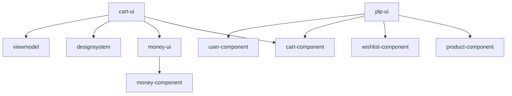

UI modules implement the **presentation layer** of the application. Each UI module corresponds to a feature screen and contains ViewModels, Compose UI screens, and UI-specific logic.

## Module Overview

<CardGroup cols={2}>
  <Card title="cart-ui" icon="shopping-cart" href="#cart-ui">
    Shopping cart screen
  </Card>
  <Card title="main-ui" icon="house" href="#main-ui">
    Main container with bottom navigation
  </Card>
  <Card title="money-ui" icon="dollar-sign" href="#money-ui">
    Money formatting and display
  </Card>
  <Card title="onboarding-ui" icon="right-to-bracket" href="#onboarding-ui">
    Login and authentication screens
  </Card>
  <Card title="plp-ui" icon="list" href="#plp-ui">
    Product listing page
  </Card>
  <Card title="wishlist-ui" icon="heart" href="#wishlist-ui">
    Wishlist screen
  </Card>
</CardGroup>

---

## Architecture Pattern

All UI modules follow a consistent structure:

```
ui-module/
├── presentation/
│   ├── view/
│   │   └── Screen.kt        # Composable UI
│   └── viewmodel/
│       ├── ViewModel.kt     # Interface
│       └── RealViewModel.kt # Implementation
├── di/
│   └── UIAssembler.kt       # DI and screen destination
├── test/
│   └── viewmodel/
│       └── RealViewModelTest.kt
└── screenshotTest/
    └── view/
        └── ScreenPreviews.kt
```

<Info>
UI modules are **Android-only** (unlike component modules which are multiplatform) and depend on Android-specific libraries like Jetpack Compose.
</Info>

---

## cart-ui

Displays the user's shopping cart and allows quantity updates.

### Module Configuration

```kotlin
plugins {
    alias(libs.plugins.android.library)
    alias(libs.plugins.compose.compiler)
    alias(libs.plugins.screenshot)
}

dependencies {
    implementation(project(":foundations"))
    implementation(project(":money-component"))
    implementation(project(":cart-component"))
    implementation(project(":money-ui"))
    implementation(project(":viewmodel"))
    implementation(project(":designsystem"))
    implementation(libs.coroutines.core)
    implementation(libs.lifecycle.viewmodel)
    
    implementation(platform(libs.androidx.compose.bom))
    implementation(libs.androidx.ui.tooling.preview)
    implementation(libs.androidx.material3)
    // ...
}
```

### ViewModel Layer

<Steps>
  <Step title="ViewModel Interface">
    Defines the contract for cart screen state and actions:

    ```kotlin
    internal interface CartViewModel : StateViewModel<CartScreenState> {
        fun updateCartItemQuantity(cartItem: CartItem)
    }

    internal data class CartScreenState(val cart: Cart)
    ```

    <Note>
    The interface extends `StateViewModel` from the `viewmodel` library module, providing the `state: StateFlow<CartScreenState>` property.
    </Note>
  </Step>

  <Step title="ViewModel Implementation">
    From `cart-ui/src/main/java/com/denisbrandi/androidrealca/cart/presentation/viewmodel/RealCartViewModel.kt`:

    ```kotlin
    internal class RealCartViewModel(
        private val observeUserCart: ObserveUserCart,
        private val updateCartItem: UpdateCartItem,
        private val stateDelegate: StateDelegate<CartScreenState>
    ) : ViewModel(), CartViewModel, StateViewModel<CartScreenState> by stateDelegate {

        init {
            stateDelegate.setDefaultState(CartScreenState(Cart(emptyList())))
            viewModelScope.launch {
                observeUserCart().collect { cart ->
                    stateDelegate.updateState { CartScreenState(cart) }
                }
            }
        }

        override fun updateCartItemQuantity(cartItem: CartItem) {
            updateCartItem(cartItem)
        }
    }
    ```

    <Tip>
    The ViewModel uses **delegation** via `StateDelegate` to manage state, keeping the implementation focused on business logic.
    </Tip>
  </Step>
</Steps>

### View Layer

From `cart-ui/src/main/java/com/denisbrandi/androidrealca/cart/presentation/view/CartScreen.kt`:

```kotlin
@Composable
internal fun CartScreen(viewModel: CartViewModel) {
    val state by viewModel.state.collectAsStateWithLifecycle()
    
    CartContent(
        cart = state.cart,
        onQuantityChanged = { cartItem ->
            viewModel.updateCartItemQuantity(cartItem)
        }
    )
}

@Composable
private fun CartContent(
    cart: Cart,
    onQuantityChanged: (CartItem) -> Unit
) {
    // Compose UI implementation
    // Uses components from designsystem module
}
```

### Dependency Injection

```kotlin
class CartUIAssembler(
    private val cartComponentAssembler: CartComponentAssembler
) {
    @Composable
    private fun makeCartViewModel(): CartViewModel {
        return viewModel {
            RealCartViewModel(
                cartComponentAssembler.observeUserCart,
                cartComponentAssembler.updateCartItem,
                StateDelegate()
            )
        }
    }

    @Composable
    fun CartScreenDestination() {
        CartScreen(makeCartViewModel())
    }
}
```

<Warning>
The `CartUIAssembler` depends on `CartComponentAssembler` from the component module. UI assemblers should **never** create component assemblers - they should receive them via constructor injection.
</Warning>

---

## main-ui

Provides the main container screen with bottom navigation for switching between PLP, Wishlist, and Cart.

### ViewModel Layer

```kotlin
internal interface MainViewModel : StateViewModel<MainScreenState>

internal data class MainScreenState(
    val wishlistBadge: Int = 0,
    val cartBadge: Int = 0
)
```

**Implementation:**

```kotlin
internal class RealMainViewModel(
    observeUserWishlistIds: ObserveUserWishlistIds,
    observeUserCart: ObserveUserCart,
    stateDelegate: StateDelegate<MainScreenState>
) : ViewModel(), MainViewModel, StateViewModel<MainScreenState> by stateDelegate {

    init {
        stateDelegate.setDefaultState(MainScreenState())
        
        viewModelScope.launch {
            observeUserWishlistIds().collect { ids ->
                stateDelegate.updateState { it.copy(wishlistBadge = ids.size) }
            }
        }
        
        viewModelScope.launch {
            observeUserCart().collect { cart ->
                stateDelegate.updateState { 
                    it.copy(cartBadge = cart.getNumberOfItems()) 
                }
            }
        }
    }
}
```

<Info>
The `MainViewModel` observes both wishlist and cart to display badge counts on the bottom navigation tabs.
</Info>

### View Layer

From `main-ui/src/main/java/com/denisbrandi/androidrealca/main/presentation/view/MainScreen.kt`:

```kotlin
@Composable
internal fun MainScreen(
    viewModel: MainViewModel,
    bottomNavRouter: BottomNavRouter
) {
    val state by viewModel.state.collectAsStateWithLifecycle()
    
    Scaffold(
        bottomBar = {
            BottomNavigationBar(
                wishlistBadge = state.wishlistBadge,
                cartBadge = state.cartBadge,
                onTabSelected = { /* ... */ }
            )
        }
    ) {
        // Display selected tab content using bottomNavRouter
    }
}
```

### Bottom Navigation Router

From `main-ui/src/main/java/com/denisbrandi/androidrealca/main/presentation/view/navigation/BottomNavRouter.kt`:

```kotlin
interface BottomNavRouter {
    @Composable
    fun OpenPLPScreen()

    @Composable
    fun OpenWishlistScreen()

    @Composable
    fun OpenCartScreen()
}
```

<Tip>
The `BottomNavRouter` interface allows the `main-ui` module to delegate screen creation to the app module, avoiding direct dependencies on other UI modules.
</Tip>

---

## money-ui

Provides presentation logic for formatting and displaying monetary values.

### Module Structure

Unlike other UI modules, `money-ui` doesn't have a full screen - it provides reusable components:

```
money-ui/
├── presentation/
│   ├── presenter/
│   │   └── MoneyPresenter.kt
│   └── view/
│       └── PriceText.kt
└── test/
    └── presenter/
        └── MoneyPresenterTest.kt
```

### Presenter

```kotlin
class MoneyPresenter {
    fun formatPrice(money: Money): String {
        return "${money.currencySymbol}${String.format("%.2f", money.amount)}"
    }
}
```

### Composable Component

```kotlin
@Composable
fun PriceText(
    money: Money,
    modifier: Modifier = Modifier
) {
    val presenter = remember { MoneyPresenter() }
    
    Text(
        text = presenter.formatPrice(money),
        modifier = modifier,
        style = MaterialTheme.typography.bodyLarge
    )
}
```

<Info>
The `money-ui` module demonstrates the **Passive View** pattern - the presenter contains all formatting logic, making the view purely declarative.
</Info>

---

## onboarding-ui

Handles user authentication flow including the login screen.

### ViewModel Layer

<Accordion title="LoginViewModel Interface">
  ```kotlin
  internal interface LoginViewModel : 
      StateViewModel<LoginScreenState>,
      EventViewModel<LoginViewEvent> {
      
      fun login(email: String, password: String)
  }

  internal data class LoginScreenState(
      val isLoading: Boolean = false,
      val errorMessage: String? = null
  )

  internal sealed interface LoginViewEvent {
      data object NavigateToMain : LoginViewEvent
  }
  ```

  <Note>
  This ViewModel implements both `StateViewModel` (for screen state) and `EventViewModel` (for one-time navigation events).
  </Note>
</Accordion>

<Accordion title="LoginViewModel Implementation">
  ```kotlin
  internal class RealLoginViewModel(
      private val login: Login,
      private val stateDelegate: StateDelegate<LoginScreenState>,
      private val eventDelegate: EventDelegate<LoginViewEvent>
  ) : ViewModel(),
      LoginViewModel,
      StateViewModel<LoginScreenState> by stateDelegate,
      EventViewModel<LoginViewEvent> by eventDelegate {

      init {
          stateDelegate.setDefaultState(LoginScreenState())
      }

      override fun login(email: String, password: String) {
          stateDelegate.updateState { it.copy(isLoading = true, errorMessage = null) }
          
          viewModelScope.launch {
              val emailObj = Email(email)
              val passwordObj = Password(password)
              
              if (!emailObj.isValid() || !passwordObj.isValid()) {
                  stateDelegate.updateState { 
                      it.copy(isLoading = false, errorMessage = "Invalid credentials")
                  }
                  return@launch
              }
              
              login(LoginRequest(emailObj, passwordObj)).fold(
                  success = {
                      stateDelegate.updateState { it.copy(isLoading = false) }
                      eventDelegate.sendEvent(viewModelScope, LoginViewEvent.NavigateToMain)
                  },
                  error = { error ->
                      stateDelegate.updateState { 
                          it.copy(isLoading = false, errorMessage = error.message)
                      }
                  }
              )
          }
      }
  }
  ```
</Accordion>

### View Layer

```kotlin
@Composable
internal fun LoginScreen(
    viewModel: LoginViewModel,
    onLoggedIn: () -> Unit
) {
    val state by viewModel.state.collectAsStateWithLifecycle()
    
    LaunchedEffect(Unit) {
        viewModel.viewEvent.collect { event ->
            when (event) {
                is LoginViewEvent.NavigateToMain -> onLoggedIn()
            }
        }
    }
    
    LoginContent(
        state = state,
        onLoginClick = { email, password ->
            viewModel.login(email, password)
        }
    )
}
```

<Warning>
Always handle one-time events (like navigation) using `EventViewModel` rather than state. This prevents events from being replayed on configuration changes.
</Warning>

---

## plp-ui

Displays the product listing page where users can browse products and add them to wishlist or cart.

### ViewModel Layer

```kotlin
internal interface PLPViewModel : StateViewModel<PLPScreenState> {
    fun loadProducts()
    fun isFavourite(productId: String): Boolean
    fun addProductToWishlist(product: Product)
    fun removeProductFromWishlist(productId: String)
    fun addProductToCart(product: Product)
}

internal data class PLPScreenState(
    val fullName: String,
    val wishlistIds: List<String> = emptyList(),
    val displayState: DisplayState? = null
)

internal sealed interface DisplayState {
    data object Loading : DisplayState
    data object Error : DisplayState
    data class Content(val products: List<Product>) : DisplayState
}
```

<Tip>
Using a sealed interface for `DisplayState` ensures the UI handles all possible states: Loading, Error, and Content.
</Tip>

### Implementation Highlights

From `plp-ui/src/main/java/com/denisbrandi/androidrealca/plp/presentation/viewmodel/RealPLPViewModel.kt`:

```kotlin
internal class RealPLPViewModel(
    private val getUser: GetUser,
    private val getProducts: GetProducts,
    private val addToWishlist: AddToWishlist,
    private val removeFromWishlist: RemoveFromWishlist,
    private val observeUserWishlistIds: ObserveUserWishlistIds,
    private val addCartItem: AddCartItem,
    stateDelegate: StateDelegate<PLPScreenState>
) : ViewModel(), PLPViewModel, StateViewModel<PLPScreenState> by stateDelegate {

    init {
        val user = getUser()
        stateDelegate.setDefaultState(PLPScreenState(fullName = user.username))
        
        viewModelScope.launch {
            observeUserWishlistIds().collect { ids ->
                stateDelegate.updateState { it.copy(wishlistIds = ids) }
            }
        }
    }

    override fun loadProducts() {
        stateDelegate.updateState { it.copy(displayState = DisplayState.Loading) }
        
        viewModelScope.launch {
            getProducts().fold(
                success = { products ->
                    stateDelegate.updateState { 
                        it.copy(displayState = DisplayState.Content(products))
                    }
                },
                error = {
                    stateDelegate.updateState { 
                        it.copy(displayState = DisplayState.Error)
                    }
                }
            )
        }
    }

    override fun addProductToCart(product: Product) {
        val cartItem = CartItem(
            id = product.id,
            name = product.name,
            money = product.money,
            imageUrl = product.imageUrl,
            quantity = 1
        )
        addCartItem(cartItem)
    }
}
```

<Info>
The PLP ViewModel coordinates multiple use cases from different components: `user-component`, `product-component`, `wishlist-component`, and `cart-component`.
</Info>

---

## wishlist-ui

Displays the user's wishlist with options to remove items or add them to cart.

### ViewModel Layer

```kotlin
internal interface WishlistViewModel : StateViewModel<WishlistScreenState> {
    fun removeFromWishlist(wishlistItemId: String)
    fun addToCart(wishlistItem: WishlistItem)
}

internal data class WishlistScreenState(
    val wishlistItems: List<WishlistItem>
)
```

### Dependency Injection

```kotlin
class WishlistUIAssembler(
    private val wishlistComponentAssembler: WishlistComponentAssembler,
    private val addCartItem: AddCartItem
) {
    @Composable
    private fun makeWishlistViewModel(): WishlistViewModel {
        return viewModel {
            RealWishlistViewModel(
                wishlistComponentAssembler.observeUserWishlist,
                wishlistComponentAssembler.removeFromWishlist,
                addCartItem,
                StateDelegate()
            )
        }
    }

    @Composable
    fun WishlistScreenDestination() {
        WishlistScreen(makeWishlistViewModel())
    }
}
```

<Note>
The `WishlistUIAssembler` receives `addCartItem` from the cart component, demonstrating cross-component use case composition.
</Note>

---

## UI Module Dependencies

UI modules can depend on:

<Steps>
  <Step title="Component Modules">
    UI modules depend on corresponding component modules for use cases and domain models.
  </Step>

  <Step title="Library Modules">
    All UI modules use `viewmodel`, `designsystem`, and sometimes `foundations`.
  </Step>

  <Step title="Other UI Modules (Limited)">
    UI modules can depend on other UI modules for shared components (e.g., `cart-ui` depends on `money-ui`).
  </Step>

  <Step title="Android Libraries">
    UI modules use Android-specific libraries like Jetpack Compose, Material3, Coil, etc.
  </Step>
</Steps>



---

## Testing UI Modules

UI modules include two types of tests:

### Unit Tests

Test ViewModels in isolation:

```kotlin
class RealCartViewModelTest {
    @get:Rule
    val mainCoroutineRule = MainCoroutineRule()

    @Test
    fun `observes cart updates`() = runTest {
        // Arrange
        val cartFlow = MutableStateFlow(Cart(emptyList()))
        val observeUserCart = ObserveUserCart { cartFlow }
        val updateCartItem = UpdateCartItem { }
        
        // Act
        val viewModel = RealCartViewModel(
            observeUserCart,
            updateCartItem,
            StateDelegate()
        )
        
        // Assert
        assertEquals(Cart(emptyList()), viewModel.state.value.cart)
    }
}
```

### Screenshot Tests

Test UI appearance:

```kotlin
@Preview
@Composable
fun CartScreenPreview() {
    PreviewTheme {
        CartContent(
            cart = Cart(listOf(/* preview data */)),
            onQuantityChanged = { }
        )
    }
}
```

<Info>
The project uses Android's screenshot testing framework (configured via `libs.plugins.screenshot`) to validate UI rendering.
</Info>

---

## Best Practices

<Warning>
**Separate State and Events**

Use `StateViewModel` for persistent screen state and `EventViewModel` for one-time events like navigation or showing toasts.
</Warning>

<Tip>
**Use Sealed Interfaces for Display States**

Model loading, error, and content states using sealed interfaces to ensure exhaustive handling in the UI.
</Tip>

<Info>
**Keep Views Dumb**

Views should be pure functions of state. All logic, including formatting and validation, belongs in ViewModels or Presenters.
</Info>

<Note>
**Use Delegation for ViewModels**

Leverage `StateDelegate` and `EventDelegate` to reduce boilerplate and focus ViewModel implementations on business logic.
</Note>

<Steps>
  <Step title="Constructor Inject Dependencies">
    Always receive use cases via constructor injection, never create them in the ViewModel.
  </Step>

  <Step title="Initialize State in init Block">
    Set default state and start collecting flows in the ViewModel's init block.
  </Step>

  <Step title="Expose Minimal Interface">
    ViewModels should only expose the methods needed by the view, nothing more.
  </Step>

  <Step title="Test ViewModels, Preview Views">
    Write unit tests for ViewModels and screenshot tests for Compose views.
  </Step>
</Steps>
